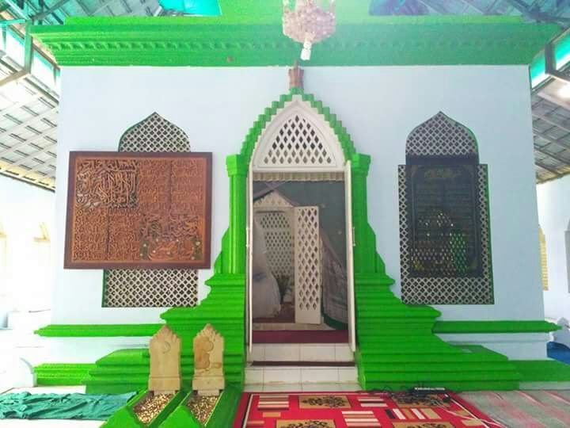
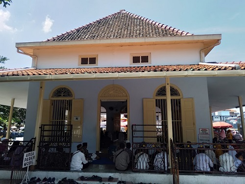
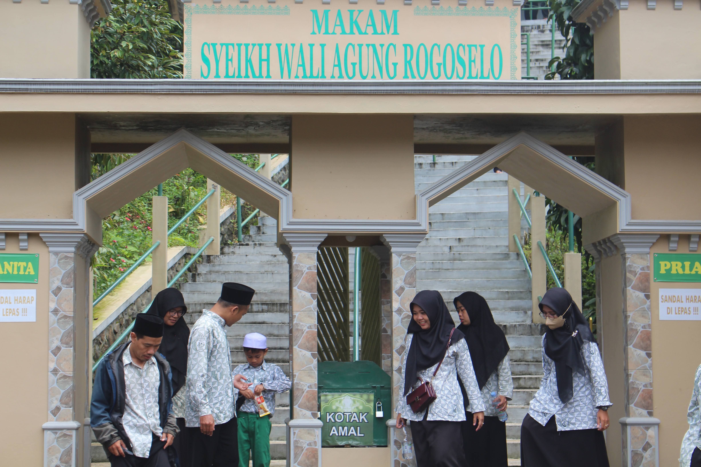

<html lang="id">
<head>
    <meta charset="UTF-8">
    <meta name="viewport" content="width=device-width, initial-scale=1.0">
    <title>Wisata Religi Indonesia</title>
    <link rel="stylesheet" href="style.css">
</head>
<body>

<header>
    <h1>Wisata Religi Makam Wali Pekalongan</h1>
    
Mari kita berziarah makam wali di Pekalongan.

</header>

    <h2>Tempat Wisata Religi Populer</h2>

    

        <h3>Makam Habib Abu Bakar bin Thoha bin Yahya</h3>
        
        
Habib Abu Bakar bin Thoha bin Yahya adalah seorang ulama besar dan habib yang dihormati di Pekalongan, Jawa Tengah. Makam beliau terletak di Jalan Sapuro, Pekalongan, dan sering dikunjungi oleh para peziarah yang datang untuk berdoa, mengingat jasa-jasa beliau dalam penyebaran Islam di daerah tersebut. Kompleks makam ini terawat dengan baik dan memiliki suasana yang tenang dan khusyuk. Banyak orang yang mengunjungi makam ini untuk memohon berkah, khususnya pada hari-hari besar Islam seperti Maulid Nabi dan Isra Miraj. Makam ini juga memiliki elemen arsitektur khas yang mencerminkan gaya arsitektur Islam Jawa.

    

    

        <h3>Makam Habib Ahmad bin Abdullah bin Thalib al-Atthas Pekalongan</h3>
        
        
Habib Ahmad bin Abdullah bin Thalib al-Atthas adalah tokoh yang sangat dihormati di kalangan masyarakat Muslim Pekalongan. Makam beliau juga terletak di Jalan Sapuro, dekat dengan Makam Habib Abu Bakar bin Thoha. Habib Ahmad dikenal sebagai seorang alim dan tokoh sufi yang mengajarkan ilmu agama Islam serta mengajarkan akhlak mulia kepada masyarakat setempat. Kompleks makamnya menjadi salah satu pusat ziarah yang ramai di Pekalongan, sering dikunjungi oleh peziarah dari berbagai daerah, terutama pada peringatan hari-hari besar Islam. Makam ini sederhana namun penuh dengan aura keagamaan, dan para peziarah datang untuk berdoa serta mengenang jasa-jasanya dalam menyebarkan ilmu agama.

    

    

        <h3>Makam Ki Ageng Rogoselo dan Ki Gede Penatas Angin</h3>
        
        
Ki Ageng Rogoselo adalah tokoh penyebar agama Islam yang legendaris di Pekalongan. Makam beliau terletak di Desa Rogoselo, Kecamatan Doro, Kabupaten Pekalongan. Ki Ageng Rogoselo dikenal sebagai sosok yang sakti dan dihormati karena kemampuannya dalam berdakwah dan menyebarkan ajaran Islam. Suasana di kompleks makam ini terasa sakral, dan peziarah datang dari berbagai wilayah untuk menghormati beliau. Menurut tradisi, Ki Ageng Rogoselo dianggap memiliki pengaruh kuat dalam perkembangan Islam dan kebudayaan lokal di wilayah Pekalongan dan sekitarnya.

        
Ki Gede Penatas Angin adalah tokoh yang juga dikenal sebagai salah satu penyebar agama Islam di daerah Pekalongan. Makam beliau terletak di Desa Karanganyar, Kecamatan Doro, Kabupaten Pekalongan. Beliau dihormati sebagai sosok yang kharismatik dan memiliki kemampuan spiritual yang tinggi. Makam ini memiliki suasana yang khas dengan arsitektur tradisional Jawa, dan sering menjadi tempat ziarah bagi masyarakat setempat. Ki Gede Penatas Angin dikenal sebagai tokoh yang bijaksana, yang turut serta dalam membimbing masyarakat untuk menjalankan ajaran Islam dan nilai-nilai kebaikan.

            Makam-makam ini tidak hanya menjadi tempat untuk mengenang jasa dan pengabdian tokoh-tokoh penyebar agama Islam di Pekalongan, namun juga menjadi pusat spiritual dan budaya yang kaya akan nilai-nilai keagamaan dan kearifan lokal. Banyak orang yang meyakini bahwa berziarah ke makam para wali dan ulama ini membawa ketenangan batin dan kedekatan spiritual.

    

<footer>
    
&copy; 2024 Wisata Religi Pekalongan | Mari Jelajahi Makam Wali di Pekalongan

</footer>

</body>
</html>
